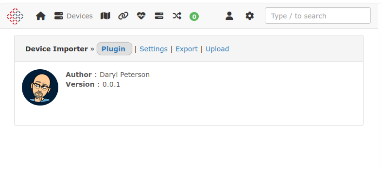

# LibreNMS Device Importer

## Create database

```bash
CREATE DATABASE librenms_plugin_db
GRANT ALL PRIVILEGES ON librenms_plugin_db.* TO [LIBRE_USER]@'localhost';
```

## Edit environment file

```bash
nano .env

PLUGIN_DB_HOST=[127.0.0.1]
PLUGIN_DB_DATABASE=librenms_plugin_db
PLUGIN_DB_USERNAME=[LIBRE_USER]
PLUGIN_DB_PASSWORD=[LIBRE_PASSWORD]
```

***Change the items in brackets [ ]  to  match your install.***

## Install using lnms command

lnms plugin:add daryl-peterson/librenms-device-importer @dev

## Add cron job

```bash
crontab -e

*/5  *    * * *   flock -n /tmp/plugin_queue.lock -c "/usr/bin/php /opt/librenms/artisan plugin:process-plugin-queue --tries=3" > /dev/null 2>&1
```


## Manual Export via MySQL
```bash
SELECT
  'hostname',
  'hardware',
  'serial',
  'os',
  'snmpver',
  'community',
  'snmp_disable'
UNION ALL
SELECT
  d.hostname, 
  d.hardware,
  d.serial,
  d.os,
  d.snmpver,
  d.community,
  d.snmp_disable
FROM devices d
INTO OUTFILE '/tmp/librenms-devices.csv'
FIELDS TERMINATED BY ','
OPTIONALLY ENCLOSED BY '"'
LINES TERMINATED BY '\n';

```


## Screen Shots

